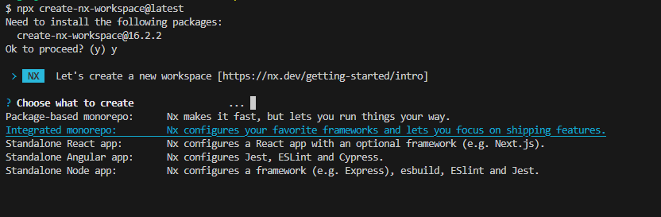
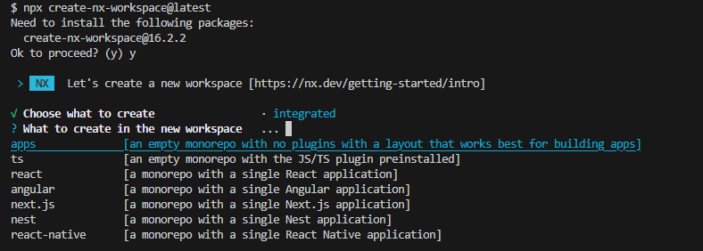
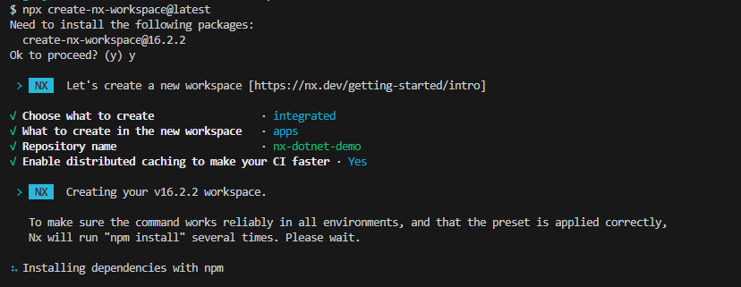

# NxDotnetDemo
<br>

# Workspace set up

Run `npm i -g @nrwl/cli` to install NX CLI globally

Run `npx create-nx-workspace@latest` to create a new workspace with the latest version, if it's not installed it'll ask to install first and then show the steps to create the workspace.

Choose `Integrate monorepo` option:



Choose `apps` option:



Set repository name (for this one was `nx-dotnet-repo`) and enable distributed cache if you want CI faster:



Run `npm i --save-dev @nx-dotnet/core` to add nx-dotnet plugin into the current workspace. Now you are able to add libaries and applications into your monorepo workspace. 

<br>

# Orders

## [Backend](https://github.com/markdown-it/markdown-it-deflist)

Generate orders API

```sh
npx nx g @nx-dotnet/core:app orders/api --template webapi --test-template xunit --language C# --skipSwaggerLib true --tags orders --no-interactive
```

Generate libraries for orders API

```sh
npx nx g @nx-dotnet/core:lib orders/domain --template classlib --test-template none --language C# --tags orders,shared --no-interactive
```

```sh
npx nx g @nx-dotnet/core:lib orders/infrastructure --template classlib --test-template none --language C# --tags orders --no-interactive
```

```sh
npx nx g @nx-dotnet/core:lib orders/use-cases --template classlib --test-template none --language C# --tags orders --no-interactive
```

Generate swagger libs for orders API

```sh
npx nx g @nx-dotnet/core:add-swagger-target --project=orders-api --codegenProject=orders-api-types --swaggerProject=orders-api-swagger --useNxPluginOpenAPI false
```

To use Nx Plugin OpenAPI in command below, you should have installed `Java 8` or higher:

```sh
npx nx g @nx-dotnet/core:add-swagger-target --project=orders-api --codegenProject=orders-api-client --swaggerProject=orders-api-def --useNxPluginOpenAPI true
```

Generate references for orders

```sh
npx nx g @nx-dotnet/core:project-reference orders-infrastructure --reference=orders-domain --no-interactive
```

```sh
npx nx g @nx-dotnet/core:project-reference orders-use-cases --reference=orders-domain --no-interactive
```

```sh
npx nx g @nx-dotnet/core:project-reference orders-use-cases --reference=orders-infrastructure --no-interactive
```

```sh
npx nx g @nx-dotnet/core:project-reference orders-api --reference=orders-use-cases --no-interactive
```

## [Frontend](https://github.com/markdown-it/markdown-it-deflist)

#### Generate orders components libraries

```sh
npx nx g @nx-dotnet/core:lib orders/components --template razorclasslib --test-template none --language C# --tags components --no-interactive
```
<br>

# Products

## [Backend](https://github.com/markdown-it/markdown-it-deflist)

#### Generate products API

```sh
npx nx g @nx-dotnet/core:app products/api --template webapi --test-template xunit --language C# --tags products --skipSwaggerLib true --no-interactive
```

#### Generate libraries for products API

```sh
npx nx g @nx-dotnet/core:lib products/domain --template classlib --test-template none --language C# --tags products,shared --no-interactive
```

```sh
npx nx g @nx-dotnet/core:lib products/infrastructure --template classlib --test-template none --language C# --tags products --no-interactive
```

```sh
npx nx g @nx-dotnet/core:lib products/use-cases --template classlib --test-template none --language C# --tags products --no-interactive
```

#### Generate swagger libs for products API

```sh
npx nx g @nx-dotnet/core:add-swagger-target --project=products-api --codegenProject=products-api-types --swaggerProject=products-api-swagger --useNxPluginOpenAPI false
```

#### Generate references for products

```sh
npx nx g @nx-dotnet/core:project-reference products-infrastructure --reference=products-domain --no-interactive
```

```sh
npx nx g @nx-dotnet/core:project-reference products-use-cases --reference=products-domain --no-interactive
```

```sh
npx nx g @nx-dotnet/core:project-reference products-use-cases --reference=products-infrastructure --no-interactive
```

```sh
npx nx g @nx-dotnet/core:project-reference products-api --reference=products-use-cases --no-interactive
```

## [Frontend](https://github.com/markdown-it/markdown-it-deflist)

#### Generate products components libraries

```sh
npx nx g @nx-dotnet/core:lib products/components --template razorclasslib --test-template none --language C# --tags components --no-interactive
```
<br>

# Sites

```sh
npx nx g @nx-dotnet/core:app sites/admin --template blazorwasm --test-template xunit --language C# --tags sites --no-interactive
```

```sh
npx nx g @nx-dotnet/core:app sites/store --template blazorwasm --test-template xunit --language C# --tags sites --no-interactive
```

Components references

```sh
npx nx g @nx-dotnet/core:project-reference sites-admin --reference=orders-components --no-interactive
```

```sh
npx nx g @nx-dotnet/core:project-reference sites-store --reference=orders-components --no-interactive
```

```sh
npx nx g @nx-dotnet/core:project-reference sites-admin --reference=products-components --no-interactive
```

```sh
npx nx g @nx-dotnet/core:project-reference sites-store --reference=products-components --no-interactive
```
<br>

# Shared

```sh
npx nx g @nx-dotnet/core:lib shared/api-utils --template classlib --test-template none --language C# --tags shared --no-interactive
```

```sh
npx nx g @nx-dotnet/core:lib shared/infrastructure-utils --template classlib --test-template none --language C# --tags shared --no-interactive
```

```sh
npx nx g @nx-dotnet/core:lib shared/framework --template classlib --test-template none --language C# --tags shared --no-interactive
```

References to shared libs

```sh
npx nx g @nx-dotnet/core:project-reference shared-infrastructure-utils --reference=shared-framework --no-interactive
```

```sh
npx nx g @nx-dotnet/core:project-reference orders-domain --reference=shared-framework --no-interactive
```

```sh
npx nx g @nx-dotnet/core:project-reference orders-infrastructure --reference=shared-framework --no-interactive
```

```sh
npx nx g @nx-dotnet/core:project-reference orders-use-cases --reference=shared-framework --no-interactive
```

```sh
npx nx g @nx-dotnet/core:project-reference orders-infrastructure --reference=shared-infrastructure-utils  --no-interactive
```

```sh
npx nx g @nx-dotnet/core:project-reference orders-use-cases --reference=shared-infrastructure-utils  --no-interactive
```

You can take a look on `demo-final` branch to see the projects created after creating the resources.

<br>

# Additional info

## Understand this workspace

Run `npx nx graph` to see a diagram of the dependencies of the projects.

## Remote caching

Run `npx nx connect-to-nx-cloud` to enable [remote caching](https://nx.app) and make CI faster.

## Further help

Visit the [Nx Documentation](https://nx.dev) and the [Nx Dotnet Documentation](https://www.nx-dotnet.com/) to learn more.